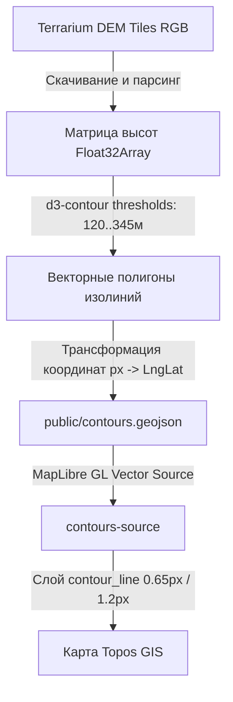

# 📅 2026-07-15: Векторные горизонтали и QGIS-интерфейс Topos

> **Основной фокус дня:** Создание автономной системы отображения рельефа без зависимости от сторонних онлайн-тайлов, а также масштабный редизайн пользовательского интерфейса в стиле профессиональной ГИС (QGIS) с максимальной экономией рабочего пространства экрана.

---

## 🧭 Связи с ядром проекта
- **Память проекта:** [[MEMORY_TOPOS]]
- **Архитектурный план:** [[plan]]
- **Оглавление знаний:** [[index]]
- **Предыдущий лог:** [[Logs/2026-07-13]]

---

## 🚀 1. Архитектурный переход от растровых тайлов к собственному вектору (`d3-contour`)

### Контекст и проблема
Ранее для отображения горизонталей рельефа использовался растровый слой тайлов `opentopomap-tiles` (PNG-картинки с сервера OpenTopoMap). Это решение имело критические недостатки:
1. **Низкое качество на высоких зумах:** пикселизация при приближении, несовпадение стилистики со светлой тактической картой.
2. **Зависимость от интернета / отсутствующий оффлайн:** растровые картинки требовали постоянного сетевого соединения и не входили в локальный векторный бандл `belarus.pmtiles`.
3. **Отсутствие гибкости:** невозможность программно менять толщину, прозрачность и цвета линий под нужды пользователя.

### Принятое решение (ADR: Option B — Vector DEM Contours)
Мы отказались от OpenTopoMap и реализовали **Вариант Б**: генерация собственных векторных изолиний прямо из данных матриц высот (SRTM / Terrarium DEM).

#### Реализация генератора: `scripts/generate_contours.js`
1. Скрипт скачивает 64 тайла цифровой матрицы высот (DEM) от Mapzen/AWS (формат Terrarium RGB), полностью покрывающих Беларусь (`23.0°–32.5°` в.д., `51.0°–56.5°` с.ш.).
2. По формуле `elevation = (R * 256 + G + B) / 256 - 32768` вычисляется точная высота каждого пикселя.
3. С помощью математического ядра `d3-contour` вычисляются полигоны и линии горизонталей для 16 уровней высот (шаг 15 метров: от 120 м до 345 м).
4. Результат сохраняется в оптимизированный файл `public/contours.geojson` размером **10.56 МБ** (10 704 векторные линии), который подгружается в MapLibre GL мгновенно.

### Стилизация горизонталей на карте (`map-layers.ts`)
- **Промежуточные горизонтали:** толщина **`0.65px`** (`#8b5a2b`), тонкие и аккуратные, не перегружающие подложку.
- **Утолщенные (основные/кратные) горизонтали:** отметки 150м, 180м, 210м, 240м, 270м, 300м, 330м выделены толщиной **`1.2px`**, что позволяет мгновенно оценивать крутизну склонов.
- **Подписи высот (`contour_label`):** автоматически следуют вдоль линий и имеют белое гало для идеального чтения.

---

## 🎨 2. Редизайн UI/UX: QGIS-style и максимальное рабочее пространство

### Внедрение дизайн-системы Persian Blue
- Цветовая гамма приложения приведена к единому стандарту `Persian Blue` (`#466bf7`) с акцентами `#1e293b` / `#0f172a`.
- Очищены все лишние тексты в скобках из названий слоев и категорий (например, `Тактические знаки (805)` -> `Тактические знаки`), что значительно повысило чистоту интерфейса.

### Оптимизация сайдбара и вынос управления слоями
По запросу пользователя сайдбар освобожден от громоздкого дерева слоев для освобождения экрана:
1. **Сайдбар как контейнер тактических знаков:** верхняя панель слоев (`top-dock`) удалена. Сайдбар теперь полностью занят каталогом тактических знаков и динамической панелью свойств выбранного объекта.
2. **Быстрое меню слоев над линейкой:**
   - В правом нижнем углу над компасом и линейкой измерений добавлена круглая кнопка со стопкой слоев (`quick-layers-btn`).
   - При клике выезжает стеклянная панель с 8 SVG-иконками, сгруппированными в сетку 4x2:
     - 🏔 **Рельеф** (горизонтали и вершины)
     - 🛡 **Военные** (укрепрайоны и полигоны)
     - ⚔️ **Знаки** (поставленные тактические маркеры)
     - 💧 **Водоемы** (реки и озера)
     - 🌲 **Леса** (лесные массивы и грунты)
     - 🛣 **Дороги** (шоссе, тропы и ж/д)
     - 🏘 **Застройка** (здания и кварталы)
     - 🏷 **Подписи** (населенные пункты и границы)
3. **Состояние по умолчанию:** горизонтали и все группы слоев в дереве по умолчанию свернуты и отключены, чтобы карта при старте была чистой и быстрой.

---

## 🎨 3. Динамическая перекраска иконок в панели свойств (Visual Studio Style)

### Запрос пользователя и технический вызов
Пользователь запросил возможность менять цвет иконки прямо в панели свойств. Поскольку все тактические символы хранятся в формате статических SVG-файлов и загружаются в растровый атлас MapLibre GL через `map.addImage()`, стандартные CSS/MapLibre стили не позволяют напрямую перекрашивать растрированное изображение без потери оригинального дизайна или сложного шейдерного пайплайна.

### Принятое архитектурное решение (`DOMParser + XMLSerializer`)
1. **Динамический DOM-парсинг SVG в памяти:** В `TacticalMapService` реализован метод `ensureSymbolColorImageLoaded(symbolId, color, callback)`. Он загружает исходный SVG-файл, разбирает его через `DOMParser` в дерево элементов и проходит по всем графическим примитивам (`path`, `polygon`, `circle`, `rect`, `line`, `polyline`, `ellipse`).
2. **Абсолютная замена цветов (`stroke` и `fill`):** Если у элемента задан контур (`stroke`), он перекрашивается в выбранный цвет. Если задана заливка (`fill`), она также заменяется на выбранный цвет. Для элементов `path` без явных атрибутов по умолчанию устанавливается новая заливка.
3. **Генерация уникального кэшированного ID:** Измененный SVG сериализуется через `XMLSerializer` и загружается в `map.addImage()` под уникальным идентификатором `${symbolId}_c_${color.replace('#', '')}`.
4. **Реактивное связывание в MapLibre:** Слой `tactical_symbols_layer` настроен на использование `['coalesce', ['get', 'iconId'], ['get', 'symbol']]` для иконок. При этом свойство `text-color` отвязано от цвета иконки и зафиксировано на `#222222` с белым гало (`#ffffff`), чтобы при изменении цвета знака текст надписи оставался читаемым и не перекрашивался.
5. **UI-палитра в панели свойств:** В закрепленной сайдбар-панели (Visual Studio Property Grid Style) добавлены:
   - Быстрые кнопки-свотчи основных тактических цветов: 🔴 Красный (`#ef4444` — противник/ударный), 🔵 Синий (`#3b82f6` — свои), 🟢 Зеленый (`#22c55e` — лес/маскировка), 🟡 Желтый (`#eab308` — химия/внимание), ⚫ Черный (`#000000`).
   - Кнопка сброса цвета на оригинальный SVG (`✕`).
   - Компактная пипетка `<input type="color" class="vs-color-input" />` для выбора любого произвольного оттенка.
   - Поддержка перекраски как **уже нанесенного объекта на карте** (`selectedPlacedSymbol`), так и **шаблона перед кликом по карте** (`selectedSymbol`).

---

## 🏰 4. Инженерная фортификация МО СССР (1984): Траншеи и Ходы сообщения

### Нормативная база и геометрия (`TrenchGeometryService`)
На основе официального руководства МО СССР "Войсковые фортификационные сооружения" (1984 год, 721 стр.) реализован высокоточный математический движок построения линейных фортификационных объектов с коррекцией проекции Меркатора по долготе (`cosLat = Math.cos(lat)` для сохранения строгих 90 градусов штриха на широтах Беларуси ~53.5°):

1. **Траншея с бруствером (`trench`)**:
   - Основная боевая траншея отрывается ломаным начертанием с бруствером в сторону противника.
   - На карте отображается осью и частыми короткими штрихами-зубцами («ресничками») с одной стороны (`step = 0.000055`, `toothLen = 0.000035`).
2. **Открытый ход сообщения (`comm_open`)**:
   - Предназначен для скрытного перемещения личного состава в тыл, к блиндажам, КНП и позициям техники (гл. II, ст. 59-64).
   - Имеет двухстороннюю отсыпку бруствера для защиты от флангового огня.
   - На карте отображается осью и чередующимися в шахматном порядке зубцами по обе стороны от оси (`s % 2 === 0` направо, `s % 2 !== 0` налево, `toothLen = 0.000032`).
3. **Крытый ход сообщения / перекрытая щель (`comm_covered`)**:
   - Перекрытые участки траншей и щели на отделение/расчет с накатом из бревен диаметром не менее 14 см и обсыпкой грунтом 60 см (гл. V, ст. 173-180).
   - На карте отображается осью и частыми сплошными поперечными перекладинами перекрытия («шпалами наката»), идущими насквозь от края до края (`[cx - dLng, cy - dLat]` -> `[cx + dLng, cy + dLat]`, `step = 0.000045`).

### Управление, интерактивность и эргономика UI (Photoshop style)
- **Панель инструментов (`app-top-toolbar`)**: размещена строго вверху на всю ширину экрана в едином светлом стиле с остальным интерфейсом. Содержит 4 квадратные кнопки с чистыми SVG-иконками без текста:
  1. *Траншея с бруствером* (`trench`)
  2. *Открытый ход сообщения* (`comm_open`)
  3. *Крытый ход сообщения / перекрытая щель* (`comm_covered`)
  4. *Проволочное заграждение / МЗП* (`wire`)
- **Разворот бруствера («⇄ Развернуть бруствер»)**: при рисовании траншей и открытых ходов бруствер или шахматный порядок может быть мгновенно инвертирован на противоположную сторону нажатием кнопки на панели свойств как в процессе рисования, так и для уже готового объекта на карте (`flipSide`, умножение вектора нормали на `-1`).
- **Удаление узлов по клику ПКМ**: реализован тройной перехват событий (`contextmenu` на слоях `linear_symbol_nodes_layer`, `linear_symbol_midpoints_layer` и на общем холсте), позволяющий мгновенно удалять любой промежуточный или конечный узел линии при нажатии правой кнопкой мыши.

---

## 📋 Итоги и следующие шаги
- [x] Автономный генератор векторных горизонталей (`generate_contours.js`).
- [x] Интеграция `contours.geojson` в MapLibre GL с толщиной `0.65px` / `1.2px`.
- [x] Очистка сайдбара от дерева слоев.
- [x] Быстрое стеклянное меню из 8 SVG-иконок в правом нижнем углу.
- [x] **Динамическая перекраска иконок в панели свойств** (Visual Studio Style Property Grid с быстрыми свотчами и пипеткой).
- [x] **Генератор тактической фортификации МО СССР 1984** (Траншеи, Открытые ходы сообщения, Крытые ходы сообщения/перекрытые щели, МЗП с коррекцией проекции Меркатора).
- [x] **Интерактивное редактирование линий**: удаление узлов по клику ПКМ и кнопка разворота бруствера на 180°.
- [ ] Нанесение полигонов укрепрайонов и тактических зон поражения.
- [ ] Построение тактических маршрутов движения.
